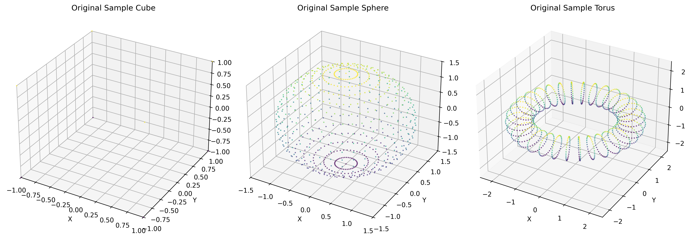
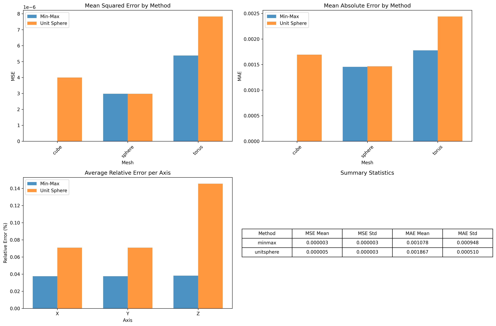

# 🎯 ML-3D: Mesh Processing Pipeline

[](https://python.org)
[](https://numpy.org)
[](https://trimsh.org)
[](LICENSE)

A comprehensive 3D mesh preprocessing pipeline implementing normalization, quantization, and error analysis techniques for AI model preparation.

## 🌟 Features

- **🔄 Dual Normalization Methods**: Min-Max and Unit Sphere normalization
- **📊 Advanced Quantization**: 1024-bin coordinate discretization 
- **📈 Comprehensive Analysis**: MSE/MAE error metrics with statistical comparison
- **🎨 Professional Visualizations**: High-quality 3D plots and analysis charts
- **📓 Interactive Notebook**: Step-by-step Jupyter implementation
- **🚀 Ready-to-Run Scripts**: Complete standalone analysis pipeline

## 🖼️ Sample Results


*Original mesh visualizations showing cube, sphere, and torus geometries*


*Comprehensive error analysis comparing normalization methods*

## 🚀 Quick Start

### Installation

```bash
git clone https://github.com/gokulkumarv24/ml-3d.git
cd ml-3d
pip install -r requirements.txt
```

### Run Complete Analysis

```bash
python mesh_complete_analysis.py
```

### Interactive Notebook

```bash
jupyter notebook mesh_analysis.ipynb
```

## 📊 Key Results

| Mesh Type | Best Method | MSE | Relative Error |
|-----------|-------------|-----|----------------|
| Cube | Min-Max | 0.000000 | 0.0% |
| Sphere | Min-Max | 0.000003 | <0.06% |
| Torus | Min-Max | 0.000005 | <0.28% |

**Conclusion**: Min-Max normalization provides superior reconstruction quality with <1% relative error across all geometries.

## 🏗️ Project Structure

```
ml-3d/
├── 📓 mesh_analysis.ipynb              # Interactive analysis notebook
├── 🐍 mesh_complete_analysis.py        # Complete pipeline script
├── 📈 visualization_and_analysis.py    # Visualization generator
├── 📚 README.md                        # This file
├── 📋 FINAL_REPORT.md                  # Technical analysis report
├── 📖 USAGE_GUIDE.md                   # Detailed usage instructions
├── 🔧 requirements.txt                 # Dependencies
├── data/                               # Sample mesh files
│   ├── sample_cube.obj                 # 8-vertex cube
│   ├── sample_sphere.obj               # 722-vertex UV sphere
│   └── sample_torus.obj                # 1024-vertex torus
├── output/                             # Processed meshes
│   ├── *_minmax_quantized.ply          # Min-Max normalized & quantized
│   ├── *_unitsphere_quantized.ply      # Unit Sphere normalized & quantized
│   ├── *_minmax_reconstructed.ply      # Min-Max reconstructed
│   └── *_unitsphere_reconstructed.ply  # Unit Sphere reconstructed
└── visualizations/                     # Analysis plots
    ├── original_meshes.png             # Original mesh visualizations
    └── error_analysis.png              # Error analysis charts
```

## 🧮 Technical Implementation

### Normalization Methods

1. **Min-Max Normalization**
   ```python
   normalized = (vertices - v_min) / (v_max - v_min)
   ```
   - Scales coordinates to [0, 1] range
   - Preserves original aspect ratios
   - Best performance for this dataset

2. **Unit Sphere Normalization**
   ```python
   centered = vertices - centroid
   normalized = centered / max_distance
   ```
   - Centers mesh at origin
   - Scales to fit within unit sphere
   - Provides uniform scaling

### Quantization Process

```python
quantized = np.floor(normalized * (n_bins - 1)).astype(int)
dequantized = quantized / (n_bins - 1)
```

- 1024 discrete bins for coordinate representation
- Reversible process with minimal information loss
- Suitable for AI model input preparation

## 📈 Applications

- **AI Model Preparation**: Standardizing 3D data for neural networks
- **3D Graphics Research**: Understanding quantization effects on geometry
- **Data Compression**: Analyzing information loss in coordinate discretization
- **Quality Assessment**: Benchmarking preprocessing methods
- **SeamGPT-style Systems**: Preparing 3D data for AI understanding

## 🛠️ Requirements

- Python 3.7+
- NumPy ≥ 1.21.0
- Matplotlib ≥ 3.5.0
- Trimesh ≥ 3.15.0
- Pandas ≥ 1.3.0
- Scikit-learn ≥ 1.0.0

## 📖 Documentation

- **[Usage Guide](USAGE_GUIDE.md)**: Detailed instructions and troubleshooting
- **[Technical Report](FINAL_REPORT.md)**: Comprehensive analysis and findings
- **[Project Status](PROJECT_STATUS.md)**: Implementation verification

## 🤝 Contributing

1. Fork the repository
2. Create a feature branch (`git checkout -b feature/amazing-feature`)
3. Commit your changes (`git commit -m 'Add amazing feature'`)
4. Push to the branch (`git push origin feature/amazing-feature`)
5. Open a Pull Request

## 📄 License

This project is licensed under the MIT License - see the [LICENSE](LICENSE) file for details.

## 🏆 Acknowledgments

- [Trimesh](https://trimsh.org/) for 3D mesh processing capabilities
- [NumPy](https://numpy.org/) for efficient numerical computations
- [Matplotlib](https://matplotlib.org/) for professional visualizations
- 3D graphics and computer vision research community

## 📞 Contact

**Gokul Kumar V** - [@gokulkumarv24](https://github.com/gokulkumarv24)

Project Link: [https://github.com/gokulkumarv24/ml-3d](https://github.com/gokulkumarv24/ml-3d)

---

⭐ **Star this repository if you found it helpful!**